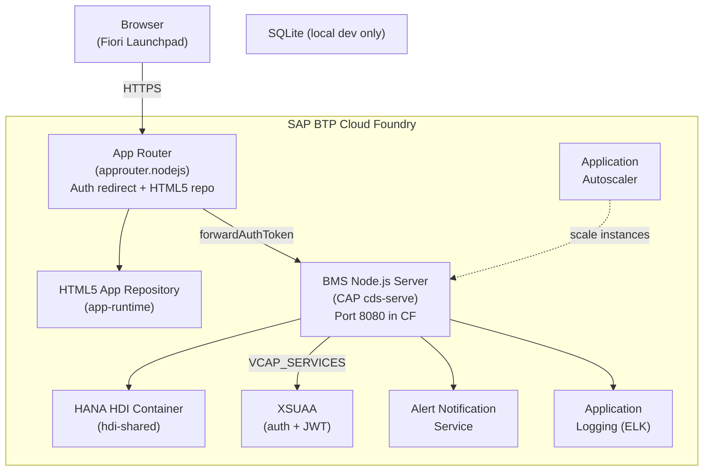

# Bridge Management System — Architecture

Version 1.7.2 | Last updated 2026-05-14

---

## Table of Contents

1. [System Context](#1-system-context)
2. [BTP Service Bindings](#2-btp-service-bindings)
3. [CAP Service Layer](#3-cap-service-layer)
4. [Custom Express Routers](#4-custom-express-routers)
5. [Security Model](#5-security-model)
6. [Data Model](#6-data-model)
7. [Frontend App Inventory](#7-frontend-app-inventory)
8. [Scoring Engines](#8-scoring-engines)
9. [Audit Trail](#9-audit-trail)
10. [Health Endpoints](#10-health-endpoints)
11. [Content Security Policy](#11-content-security-policy)

---

## 1. System Context



### Local development flow

```
Browser → http://localhost:8008/fiori-apps.html
       → CAP cds-serve (dummy auth)
       → SQLite db.sqlite
```

---

## 2. BTP Service Bindings

Defined in `mta.yaml`. The srv module requires all of these at runtime:

| Service | Type | Plan | Purpose |
|---|---|---|---|
| `BridgeManagement-auth` | XSUAA | `application` | JWT token validation, role assignment |
| `BridgeManagement-db` | HANA HDI | `hdi-shared` | Primary database |
| `BridgeManagement-destination` | Destination | `lite` | External API destinations |
| `BridgeManagement-logging` | Application Logs | `lite` | Structured log shipping to ELK |
| `BridgeManagement-autoscaler` | Autoscaler | `standard` | CPU/memory-based instance scaling |
| `BridgeManagement-alert-notification` | Alert Notification | `standard` | Email/SMS alerts for overdue inspections, expiring permits |
| `BridgeManagement-html5-repo-host` | HTML5 Apps Repo | `app-host` | Upload app artifacts during deploy |
| `BridgeManagement-html5-runtime` | HTML5 Apps Repo | `app-runtime` | Serve apps at runtime via App Router |

The App Router (`BridgeManagement` module) provides to downstream: `app-protocol` and `app-uri` consumed by the XSUAA redirect-uris config.

---

## 3. CAP Service Layer

### Service map

| CAP Service | CDS file | Handler file | OData path |
|---|---|---|---|
| `BridgeManagementService` | `srv/service.cds` | `srv/service.js` (barrel) + `srv/handlers/*.js` | `/odata/v4/bridge-management/` |
| `AdminService` | `srv/admin-service.cds` | `srv/admin-service.js` | `/odata/v4/admin/` |
| `PublicBridgeService` | `srv/services/public-bridge.cds` | inline | `/odata/v4/public/` |

### Key architectural rule

`BridgeManagementService` and `AdminService` are **entirely separate CAP `ApplicationService` instances**. Both project the same `bridge.management.*` DB entities but their event handlers are isolated. A handler registered on `BridgeManagementService` does NOT fire for `AdminService` requests, and vice versa.

Anything that must work from the Fiori Elements ObjectPage (which uses `AdminService`) must be implemented in `srv/admin-service.js`.

### CDS service definitions

`srv/service.cds` imports domain service projections from `srv/services/*.cds`. The barrel pattern means adding a new entity requires:

1. A schema file in `db/schema/`
2. A service CDS projection in `srv/services/`
3. A handler in `srv/handlers/`
4. Registration in `srv/service.js`
5. Parallel implementation in `srv/admin-service.cds` + `srv/admin-service.js` for FE4 access

---

## 4. Custom Express Routers

Mounted via `cds.on('bootstrap', app => { ... })` in `srv/server.js`. All routers require authentication + scope middleware before route definitions.

| Mount path | Source file | Primary purpose |
|---|---|---|
| `/mass-upload/api/` | `srv/mass-upload.js` | Upload/validate CSV and XLSX files, template generation |
| `/mass-edit/api/` | `srv/server.js` (inline) | Bulk field-level edit for bridges and restrictions |
| `/map/api/` | `srv/server.js` (inline) | Bridge GeoJSON feed, WMS proxy, reference layers |
| `/dashboard/api/` | `srv/server.js` (inline) | Analytics aggregates for KPI tiles |
| `/reports/api/` | `srv/reports-api.js` | Risk register, data quality, condition reports |
| `/attributes/api/` | `srv/attributes-api.js` | EAV attribute CRUD |
| `/bhi-bsi/api/` | `srv/bhi-bsi-api.js` | Multi-modal BHI/BSI scoring (feature-flagged) |
| `/admin-bridges/api/` | `srv/server.js` (inline) | Bridge attachments, QR, PDF bridge card |
| `/system/api/` | `srv/server.js` (inline) | Feature flags GET/PATCH, user-info, SystemConfig |
| `/qr/` | `srv/qr-api.js` | QR code PNG generation |
| `/public-bridge/` | `srv/server.js` (inline) | Unauthenticated public bridge card |
| `/health` | `srv/server.js` (inline) | Liveness probe |
| `/health/deep` | `srv/server.js` (inline) | DB ping + HANA connectivity check |

### Router security middleware order

```
app.use('/some/api',
  requiresAuthentication,      // XSUAA JWT check
  requireScope('admin'),        // scope check
  validateCsrfToken,            // POST/PUT/DELETE only
  express.json({ limit: '25mb' }), // BEFORE route definitions
  router
)
```

`express.json()` must be the first middleware on a router — before route definitions, or POST/PUT bodies arrive as `undefined`.

---

## 5. Security Model

### XSUAA Scopes

Defined in `xs-security.json`:

| Scope | Short name | Purpose |
|---|---|---|
| `$XSAPPNAME.admin` | `admin` | Full system administration |
| `$XSAPPNAME.manage` | `manage` | Create, edit, delete bridges and restrictions |
| `$XSAPPNAME.operate` | `operate` | Manage restrictions in assigned state |
| `$XSAPPNAME.inspect` | `inspect` | Record inspection findings and condition ratings |
| `$XSAPPNAME.view` | `view` | Read-only access |
| `$XSAPPNAME.executive_view` | `executive_view` | Header KPIs only, no editable tabs |
| `$XSAPPNAME.external_view` | `external_view` | Public card view — unauthenticated route |
| `$XSAPPNAME.certify` | `certify` | Approve/reject load rating certs and permits |
| `$XSAPPNAME.config_manager` | `config_manager` | Enable/disable feature flags and system config |

### Role templates

| Template | Scopes |
|---|---|
| `BMS_ADMIN` | All 9 scopes |
| `BMS_BRIDGE_MANAGER` | manage, inspect, view, certify |
| `BMS_OPERATOR` | operate, inspect, view |
| `BMS_INSPECTOR` | inspect, view |
| `BMS_VIEWER` | view |
| `BMS_EXECUTIVE_VIEWER` | executive_view, view |
| `BMS_EXTERNAL_VIEWER` | external_view |
| `BMS_CONFIG_MANAGER` | config_manager, view |

### CAP `@requires` vs `requireScope()`

- `@requires` annotations in CDS files gate OData endpoints only.
- Custom Express routers mounted via `app.use()` are NOT gated by `@requires`. They require explicit `requireScope()` middleware.

```js
// srv/server.js
function requireScope(...scopes) {
  return (req, res, next) => {
    const userScopes = req.authInfo?.getGrantedScopes() || []
    if (scopes.some(s => userScopes.includes(`${xsappname}.${s}`))) return next()
    res.status(403).json({ error: 'Insufficient scope' })
  }
}
```

### Input security

| Concern | Implementation |
|---|---|
| ISO date strings | Regex `/^\d{4}-\d{2}-\d{2}$/` before `new Date()` |
| Numeric range | `Math.max(min, Math.min(max, value))` on all query params |
| Dynamic field lookup | `ALLOWED_RULE_FIELDS` Set whitelist for `bridge[field]` patterns |
| JSON parse | `try { JSON.parse(v) } catch(_) { return null }` pattern |
| SQL injection | Parameterised CDS queries only — never string-concatenate |

---

## 6. Data Model

### Core entity relationships

```mermaid
erDiagram
    Bridges ||--o{ BridgeInspections : "has"
    Bridges ||--o{ BridgeDefects : "has"
    Bridges ||--o{ BridgeCapacities : "has"
    Bridges ||--o{ BridgeRiskAssessments : "has"
    Bridges ||--o{ BridgeConditionSurveys : "has"
    Bridges ||--o{ BridgeLoadRatings : "has"
    Bridges ||--o{ BridgePermits : "has"
    Bridges ||--o{ BridgeScourAssessments : "has"
    Bridges ||--o{ NhvrRouteAssessments : "has"
    Bridges ||--o{ AlertsAndNotifications : "targets"
    Bridges ||--o{ LoadRatingCertificates : "has"
    Bridges ||--o{ BridgeElements : "has"
    Bridges ||--o{ BridgeCarriageways : "has"
    Bridges ||--o{ BridgeMehComponents : "has"
    Bridges ||--|{ BridgeRestrictions : "Composition"
    Bridges ||--|{ BridgeDocuments : "Composition"
    Bridges ||--|{ BridgeAttributes : "Composition"
    Restrictions ||--o{ RestrictionProvisions : "Composition"
    BridgeInspections ||--o{ BridgeInspectionElements : "has"
    BridgeInspections ||--o{ BridgeDefects : "linked"
    NhvrRouteAssessments ||--|{ NhvrApprovedVehicleClasses : "Composition"
    AttributeGroups ||--|{ AttributeDefinitions : "Composition"
    AttributeDefinitions ||--o{ AttributeAllowedValues : "has"
    Bridges ||--o{ AttributeValues : "EAV"
```



### Composition vs Association

| Relationship | Type | Reason |
|---|---|---|
| `Bridges → BridgeRestrictions` | Composition | Owned by bridge, no standalone CRUD needed |
| `Bridges → BridgeDocuments` | Composition | Owned attachments |
| `Bridges → BridgeAttributes` | Composition | EAV values |
| `Bridges → BridgeInspections` | Association | Standalone CRUD tile |
| `Bridges → BridgeDefects` | Association | Standalone CRUD tile, soft-delete required |
| `Bridges → BridgeCapacities` | Association | Standalone CRUD tile |
| `Bridges → BridgeRiskAssessments` | Association | Standalone CRUD tile |
| `Restrictions → RestrictionProvisions` | Composition | Always owned by restriction |
| `NhvrRouteAssessments → NhvrApprovedVehicleClasses` | Composition | Always owned by assessment |

Association (not Composition) is used for any entity that needs its own standalone FE4 ListReport + Create button. Composition under a `@odata.draft.enabled` root entity blocks standalone CRUD with "can only be modified via its root entity" (HTTP 400/403).

### Entity PK strategy

| Entity | PK | Rationale |
|---|---|---|
| `Bridges` | `Integer` (sequential) | Matches existing TfNSW numbering systems; enables integer-based bridgeId format |
| `Restrictions` | `cuid` (UUID) | Standalone entity, no legacy PK requirement |
| All sub-domain entities | `cuid` (UUID) | Safe for distributed create, no collision risk |

### Soft-delete standard

All sub-domain entities have `active: Boolean default true`. Hard deletes are disabled via `@Capabilities.DeleteRestrictions.Deletable: false` in annotations. Entities covered: `BridgeInspections`, `BridgeDefects`, `BridgeRiskAssessments`, `NhvrRouteAssessments`, `LoadRatingCertificates`, `Restrictions`.

`deactivate()` and `reactivate()` bound actions are the write path for status changes.

### Lookup tables

All reference data lives in `bridge.management.*` lookup entities seeded from `db/data/`:

`States`, `Regions`, `StructureTypes`, `PostingStatuses`, `ConditionStates`, `ConditionTrends`, `InspectionTypes`, `ScourRiskLevels`, `PbsApprovalClasses`, `RestrictionTypes`, `RestrictionCategories`, `RestrictionUnits`, `VehicleClasses`, `SurfaceTypes`, `SubstructureTypes`, `FoundationTypes`, `WaterwayTypes`, `DefectCodes`, `FatigueDetailCategories`, `AssetClasses`, `DesignLoads`

### CDS enum types (auto-generate FE4 value-help)

Defined in `db/schema/enum-types.cds`:

| Type | Used on |
|---|---|
| `LoadRatingVehicleClass` | `BridgeLoadRatings.vehicleClass` |
| `LoadRatingMethod` | `BridgeLoadRatings.ratingMethod` |
| `InspectionStandard` | `BridgeInspections.inspectionStandard` |
| `RatingLevel` | `LoadRatingCertificates.ratingLevel` |

---

## 7. Frontend App Inventory

| App module | FLP Inbound | Framework | Description |
|---|---|---|---|
| `app/admin-bridges` | `Bridges-manage` | Fiori Elements v4 + custom XML | Bridge Asset Registry — primary app. FE4 ListReport + ObjectPage with 15+ tabs |
| `app/bms-admin` | `BmsAdmin-manage` | Custom XML views | Admin console: Change Docs, Data Quality, Mass Upload, Mass Edit, User Access, System Config, BNAC Config, GIS Config, Custom Attributes, Feature Flags |
| `app/mass-upload` | `MassUpload-manage` | Custom XML | Standalone mass upload wizard |
| `app/mass-edit` | `MassEdit-manage` | Custom XML | Bulk field editor for bridges and restrictions |
| `app/map-view` | `Map-display` | Custom XML + Leaflet.js | GIS map with bridge markers, WMS overlays, viewport filter |
| `app/dashboard` | `Dashboard-display` | Custom XML | Executive KPI dashboard — 12 tiles with drill-down |
| `app/restrictions` | `Restrictions-manage` | Fiori Elements v4 | Standalone restrictions register |
| `app/attributes-admin` | `AttributesAdmin-manage` | Custom XML | EAV attribute group/definition management |
| `app/operations/bridges` | `OperationsBridges-display` | Free-style UIComponent | Field-staff read-only bridge list |
| `app/operations/restrictions` | `OperationsRestrictions-display` | Free-style UIComponent | Field-staff read-only restrictions list |

### Sub-domain tiles in `admin-bridges` (FLP inbound `#Bridges-manage&/EntityRoute`)

| Tile | Route | Entity |
|---|---|---|
| Bridge Inspections | `#Bridges-manage&/BridgeInspections` | `BridgeInspections` |
| Bridge Defects | `#Bridges-manage&/BridgeDefects` | `BridgeDefects` |
| Bridge Capacity | `#Bridges-manage&/BridgeCapacities` | `BridgeCapacities` |
| Risk Assessments | `#Bridges-manage&/BridgeRiskAssessments` | `BridgeRiskAssessments` |
| Load Ratings | `#Bridges-manage&/BridgeLoadRatings` | `BridgeLoadRatings` |
| Load Rating Certs | `#Bridges-manage&/LoadRatingCertificates` | `LoadRatingCertificates` |
| Condition Surveys | `#Bridges-manage&/BridgeConditionSurveys` | `BridgeConditionSurveys` |
| Permits | `#Bridges-manage&/BridgePermits` | `BridgePermits` |
| Scour Assessments | `#Bridges-manage&/BridgeScourAssessments` | `BridgeScourAssessments` |
| NHVR Assessments | `#Bridges-manage&/NhvrRouteAssessments` | `NhvrRouteAssessments` |
| Alerts | `#Bridges-manage&/AlertsAndNotifications` | `AlertsAndNotifications` |
| Network Reports | `#Bridges-manage&/NetworkReports` | (dashboard embed) |
| AssetIQ Scores | `#Bridges-manage&/AssetIQScores` | `AssetIQScores` |

### Frontend architecture patterns

**FE4 apps** (`admin-bridges`, `restrictions`): Use `sap/fe/core/AppComponent`, OData binding, `@odata.draft.enabled` for edit, `@UI.*` CDS annotations. Extension controllers in `webapp/ext/controller/`.

**Custom XML apps** (`bms-admin`, `mass-upload`, `mass-edit`, `dashboard`): Use `sap/ui/core/UIComponent` with `rootView`, JSONModel, plain `fetch()` calls to REST APIs. No OData binding.

**Free-style UIComponent apps** (`operations/*`): Extend `sap/ui/core/UIComponent`, `<App><Page>` root required for correct height sizing.

### `xs-app.json` routing

Each app's `xs-app.json` must list explicit routes for its custom REST endpoints before the catch-all `html5-apps-repo-rt` route. Missing routes cause 404 in BTP even though the same paths work locally.

---

## 8. Scoring Engines

Three scoring systems coexist. They are independent and serve different purposes.

| Engine | Field | Storage | Trigger | Feature flag |
|---|---|---|---|---|
| BSI (Bridge Sufficiency Index) | `bsiScore : Decimal(5,2)` | Virtual — computed in `after('READ', Bridges)` | Every read | None — always computed |
| AssetIQ Score | `AssetIQScores` entity | Persisted — `AssetIQScores` table | `scoreAllBridges()` AdminService action (on-demand batch) | None |
| BHI/NBI (Multi-modal) | `bhi`, `nbi` virtual fields on Bridges | Virtual — computed in `after('READ', Bridges)` | Every read when flag enabled | `bhiBsiAssessment` |

### BSI formula

```
bsiScore = structural + width + barrier + routeAlt  (max 100)

structural = (conditionRating / 10) × 55
width      = (bsiWidthRating / 10) × 15
             bsiWidthRating: deckWidth ≥7.3 → 9, ≥4.5 → 5, else 2
barrier    = 5 (default, no field yet)
routeAlt   = 10 (default, no field yet)
```

### AssetIQ formula (5 factors)

| Factor | Weight | Source field |
|---|---|---|
| Bridge Condition Index (BCI) | 35% | `conditionRating` |
| Age | 15% | `yearBuilt` |
| Traffic | 20% | `averageDailyTraffic` |
| Defect severity | 20% | open defect count / severity |
| Load rating utilisation | 10% | `loadRating` vs posted limits |

### BHI/BSI multi-modal engine (`srv/bhi-bsi-engine.js`)

6 transport modes: Road, Rail, Metro, LightRail, Ferry, Port. Exposed via `/bhi-bsi/api`:

| Endpoint | Auth | Feature flag |
|---|---|---|
| `POST /bhi-bsi/api/assess` | Required | `bhiBsiAssessment` |
| `GET /bhi-bsi/api/network-summary` | Required | `bhiBsiAssessment` |
| `GET /bhi-bsi/api/mode-params` | None | None |

Returns HTTP 503 when the feature flag is disabled.

---

## 9. Audit Trail

Every entity mutation writes field-level change records to `bridge.management.ChangeLog`.

### ChangeLog entity fields

| Field | Type | Content |
|---|---|---|
| `ID` | UUID | Auto-generated |
| `batchId` | UUID | Groups all field changes from one save operation |
| `objectType` | String | e.g. `'Bridge'`, `'Restriction'`, `'Inspection'` |
| `objectId` | String | Primary key as string |
| `objectName` | String | Human-readable record name |
| `fieldName` | String | CDS property name |
| `oldValue` | String | Pre-mutation value |
| `newValue` | String | Post-mutation value |
| `source` | String | `'OData'` \| `'MassEdit'` \| `'MassUpload'` |
| `changedBy` | String | XSUAA user ID or `'system'` |
| `changedAt` | DateTime | Auto (managed mixin) |

### Coverage

All 18 major entities have `writeChangeLogs()` calls in their handlers. The BMS Admin "Change Documents" screen (`#BmsAdmin-manage → changeDocuments`) surfaces this data grouped by `batchId`, classified as `Create` (all `oldValue = null`) or `Change`.

---

## 10. Health Endpoints

| Endpoint | Response | Purpose |
|---|---|---|
| `GET /health` | `{ status: 'ok' }` | CF liveness probe |
| `GET /health/deep` | `{ status, db, version }` | DB ping + connectivity check — use for smoke test after deploy |

---

## 11. Content Security Policy

Configured via Helmet (`srv/server.js`).

### `script-src`

Includes `'unsafe-eval'` — required for UI5 1.145 `requireSync` loader. Without this, the browser throws `EvalError: Evaluating a string as JavaScript violates CSP` and the entire component fails to load.

### `img-src` and `connect-src`

Must include:
- `https://*.tile.openstreetmap.org` — Leaflet basemap tiles
- `https://unpkg.com` — Leaflet CDN assets
- `https://cdnjs.cloudflare.com` — additional map libraries

Without these, the browser silently blocks tile requests and shows a grey map. No error appears in the application UI.

### No wildcard origins

`connect-src` does not include `*`. Only the specific tile CDNs above, plus the BTP app URL pattern, are allowed.
